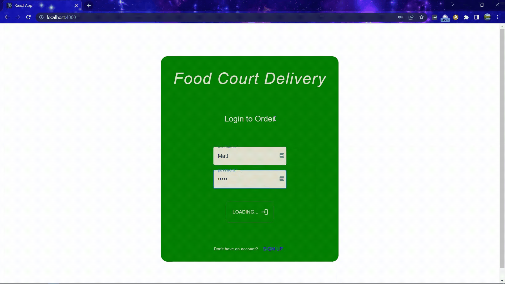
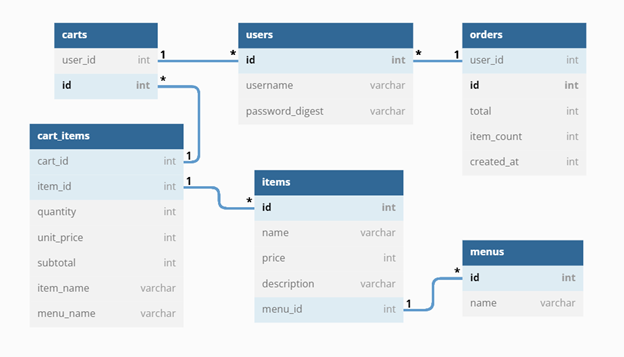
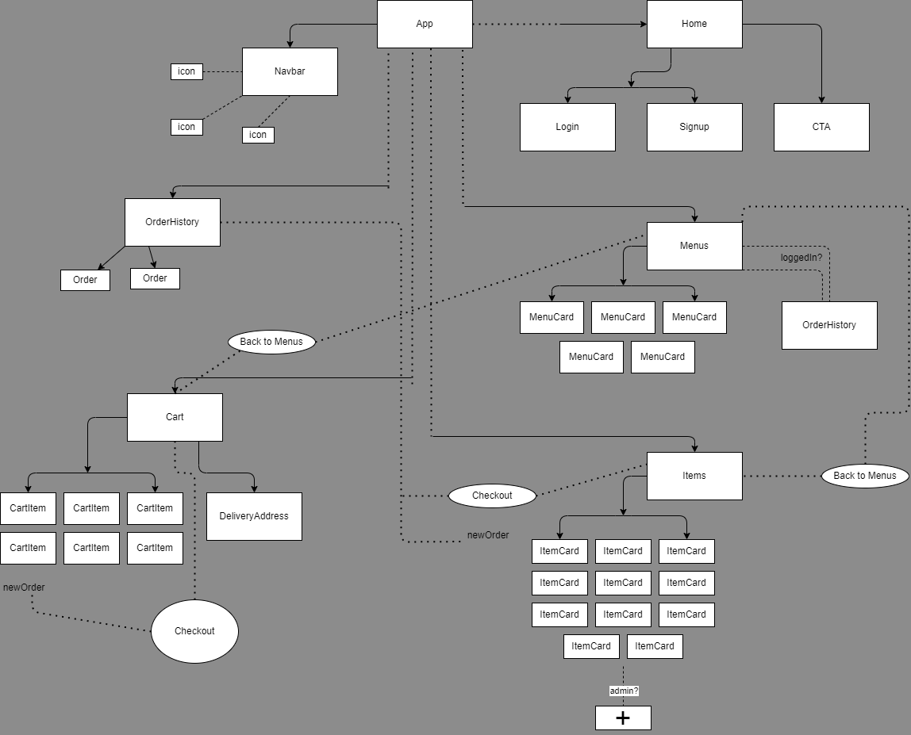

# _Foodcourt Delivery_ <a id="top"></a>

## __Description__
"Foodcourt Delivery" allows the user to explore multiple fictional food menus and order items from any of them. You'll have access to a cart, and the ability to create new items in each menu. Access to these menus is granted with creation of an account, with login and an authenticated password.

_I created this full stack app to demonstrate my proficiency in Rails and React for my Phase 4 project at Flatiron School._

-----

## __Table of Contents__
* [Requirements](#req)
* [Media](#media)
* [ActiveRecord Table Relationships](#rel)
* [Routes](#routes)
* [License](#license)

## __Requirements__ <a id="req"></a>

- [Ruby v2.7.4](https://www.ruby-lang.org/en/news/2021/07/07/ruby-2-7-4-released/)
- [npm v8.9.0](https://www.npmjs.com/package/npm/v/8.9.0)
- [PostgreSQL v14.4](https://www.postgresql.org/docs/current/tutorial-install.html)

To run this app locally, fork and clone this repo and make sure you have the above requirements installed. Then install all dependencies and start up your Postgres server:

```
bundle install
npm install --prefix client
sudo service postgresql start
rails db:create db:migrate db:seed
```

You can use the following commands to run the application:

- `rails s` to run the backend on [http://localhost:3000](http://localhost:3000)
- In a separate terminal use `npm start --prefix client` to run the frontend on
  [http://localhost:4000](http://localhost:4000)

If you need to run the app on different ports, be sure to update the Proxy in `./client/package.json`, `./config/puma.rb`, and `./Procfile.dev`, and re-install dependencies.

-------
-------
## __Media__ <a id="media"></a>
##### [Back to Top](#top)

### Youtube Video Demo
[Check out the video demo here](https://youtu.be/y9ZBeHlyToM)



-----

### DB Diagram of table relationships



-----

### React Component Flowchart



-------
-------
## Relationships <a id="rel"></a>
##### [Back to Top](#top)
### User
```has_many :orders```

```has_one :cart```

### Order
```belongs_to :user```

### Cart
```belongs_to :user```

```has_many :cart_items```

```has_many :items, through: :cart_items```

### CartItem
```belongs_to :cart```

```belongs_to :item```

### Item
```has_many :order_items```

```belongs_to :menu```

### Menu
```has_many :items```


------------
------------
## __Routes__ <a id="routes"></a>
##### [Back to Top](#top)
```
PREFIX        VERB    URI PATTERN         CONTROLLER#ACTION

cart_items    GET     /cart_items           cart_items#index
              POST    /cart_items           cart_items#create
cart_item     PATCH   /cart_items/:id       cart_items#update
              PUT     /cart_items/:id       cart_items#update
              DELETE  /cart_items/:id       cart_items#destroy
orders        GET     /orders               orders#index
              POST    /orders               orders#create
items         GET     /items                items#index
              POST    /menus/:menu_id/items items#create
menus         GET     /menus                menus#index
menu          GET     /menus/:id            menus#show
login         POST    /login                sessions#create
logout        DELETE  /logout               sessions#destroy
signup        POST    /signup               users#create
me            GET     /me                   users#show
empty_cart    DELETE  /empty_cart           cart_items#empty_cart
              GET     /*path                fallback#index
```

-------
-------

## License <a id="license"></a>
[Read the license here](./LICENSE)

##### [Back to Top](#top)